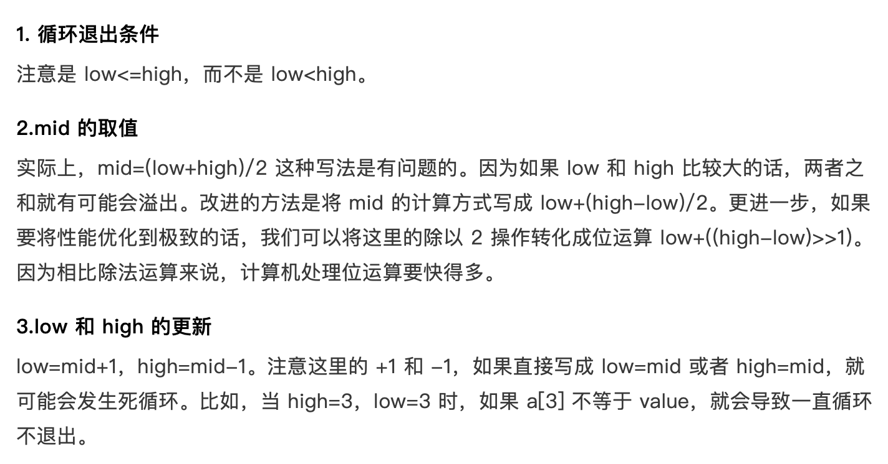

二分查找的对象是：有序数组。这点特别需要注意。要把数组排好序先。怎么排序，可以参看我这里多篇排序问题的文章。

基本步骤：

- 从数组的中间元素开始，如果中间元素正好是要查找的元素，则搜素过程结束；
- 如果某一特定元素大于或者小于中间元素，则在数组大于或小于中间元素的那一半中查找，而且跟开始一样从中间元素开始比较。
- 如果在某一步骤数组为空，则代表找不到。

这种搜索算法每一次比较都使搜索范围缩小一半。时间复杂度：O(logn)

```Python
# 递归版本
def binarySearch(array, key, low, high):
    if high < low:
        return -1
    mid = (low + high)//2

    if array[mid] == key:
        return mid
    elif array[mid] > key:
        return binarySearch(array, key, low, mid-1)    
    else:
        return binarySearch(array,key,mid+1,high)

# 非递归版本
def binarySearch2(array,key):
    low,high = 0,len(array)-1

    while low <= high:
        mid = (low + high)//2
        if array[mid] < key:
            low = mid+1
        elif array[mid] > key:
            high = mid-1
        else:
            return mid        

    return -1        

if __name__ == '__main__':
    array = [1,3,4,5,6,7,8,9]
    
    print(binarySearch(array,1,0,len(array)-1))
    print(binarySearch2(array,1))
```

-

## 局限性
- 数据结构必须是顺序表，也就是数组
- 数据必须有序
- 数据量太小不适合二分查找
    - 比如10个数据，一次遍历就可以了
    
- 数据量太大也不适合
    - 因为数据必须以连续内存的形式存储在 memory 当中


## 二叉搜索的四种变形


### 变体1,查找第一个值等于给定值的元素
```Python
def binarySearch(nums,key,low,high):
    if high < low:
        return -1
    mid = ((high - low) >> 1) + low

    if nums[mid] < key:
        return binarySearch(nums,key,mid+1,high )
    elif nums[mid] > key:
        return binarySearch(nums,key,low,mid-1)
    else:
        if mid == 0 or nums[mid-1] != key: 
            return mid
        else: 
            high = mid - 1
            return binarySearch(nums,key,low,mid-1)
```

### 变体2, 查找最后一个值等于给定值的元素
```Python
def binarySearch2(nums,key):
    low,high,n = 0, len(nums)-1, len(nums)-1  

    while low <= high:
        mid = ((high-low) >> 1) + low

        if nums[mid] < key:
            low = mid + 1
        elif nums[mid] > key:
            high = mid - 1
        else:
            if mid == n or nums[mid+1] != key:
                return mid
            else:
                low = mid + 1 

    return -1 
```

### 变体3,查找第一个大于等于给定值的元素
```Python
def binarySearch3(nums,key,low,high):
    if high < low:
        return -1

    mid = ((high - low) >> 1) + low
    if nums[mid] >= key:
        if mid == 0 or nums[mid-1] < key: return mid
        else:   return binarySearch3(nums,key,low,mid-1)
    else:
        return binarySearch3(nums,key,mid+1,high)
```

### 变体4,查找第一个小于等于给定值的元素
```Python
def binarySearch4(nums,key):
    low,high,n = 0,len(nums)-1,len(nums)-1

    while low<= high:
        mid = ((high - low) >> 1) + low

        if nums[mid] <= key:
            if mid == n or nums[mid+1] > key: 
                return mid
            else: 
                low = mid + 1
        else:
            high = mid - 1

    return -1
```


## 变体5,查找第一个比某元素大的元素
```Python
def find_first_big(nums,key):
    low,high,n = 0,len(nums)-1,len(nums)-1
    while low <= high:
        mid = ((high-low)>>1) + low

        if nums[mid] <= key:
            low = mid + 1
        else:
            if mid == n or nums[mid-1] <= key:
                return nums[mid]
            else:
                high = mid - 1
    return -1   
```